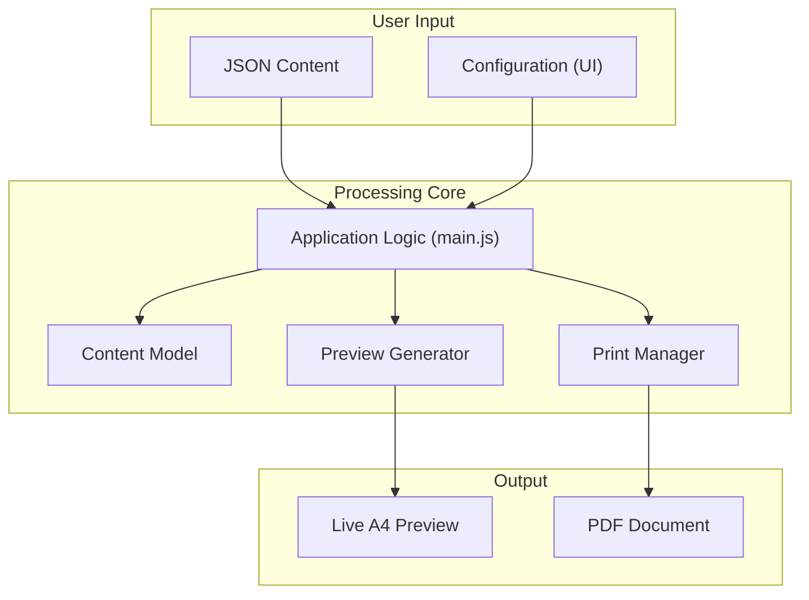

# PCA Papyrus

**Advanced PDF Generation and Preview Tool for Mathematical Content**

A production-ready mathematical document generation system featuring a real-time A4 preview, KaTeX math rendering, dynamic multi-document support, and configurable page layouts for professional PDF output.

## 🌟 Features at a Glance

- **📐 Precision A4 Preview**: Real-time, accurate A4 page rendering with exact measurements.
- **📄 Dynamic Multi-Document Support**: Manage, preview, and print multiple documents in a single session with a dynamic tab-based interface.
- **🧮 Mathematical Typesetting**: Advanced KaTeX integration for professional math notation.
- **⚙️ Live Configuration**: Adjust margins, fonts, and spacing in real-time.
- **🖨️ Streamlined Print Output**: Print all documents at once or just the active one, using a seamless, no-popup print process.
- **📊 Content Analytics**: Detailed statistics showing height usage and page breakdown.

## 🚀 Quick Start

1.  **Start the development server:**
    ```bash
    python3 serve.py
    ```

2.  **Open the application:**
    ```bash
    open http://127.0.0.1:8009/scenery/main.html
    ```

## 📚 Documentation

For a detailed technical overview of the architecture and workflow, please see the **[Technical Summary](docs/technical-summary.md)**.

---

## Architecture Overview

The diagram below illustrates the modular architecture of PCA Papyrus, showing how different components interact to provide a seamless document management experience.



## JSON Content Structure

PCA Papyrus uses a structured JSON format. Each object in the array represents a content block.

```json
[
  {
    "id": "header-section",
    "html": "<table style='width: 100%;'><tr><td>Name:</td></tr></table>",
    "classes": ["font-mono"],
    "style": "font-size: 12px;",
    "isPapyrusHeader": true
  },
  {
    "id": "main-title",
    "html": "<div>Advanced Calculus</div>",
    "style": "font-size: 24px; font-weight: bold; text-align: center;"
  },
  {
    "id": "question-1",
    "html": "<div>1) Find the derivative of $f(x) = x^2 \\sin(x)$</div>"
  }
]
```
- **`isPapyrusHeader: true`**: A special property that makes the element repeat at the top of every page.

## File Structure

```
pca-papyrus/
├── README.md
├── LICENSE
├── serve.py
│
├── scenery/
│   ├── main.html                      # The main application entrypoint
│   └── sujets0-auto-example.json    # The default example file
│
├── src/
│   ├── index.js                     # Main entry point for all modules
│   ├── core/
│   │   ├── app-init.js              # Core application logic and event handling
│   │   ├── content-model.js         # Content processing engine
│   │   ├── print-manager.js         # Print functionality
│   │   ├── margin-config.js         # Page layout configuration
│   │   ├── font-config.js           # Typography configuration
│   │   ├── page-number-config.js    # Page numbering
│   │   │
│   │   ├── preview/                 # Preview generation module
│   │   │   ├── index.js
│   │   │   ├── calculator.js
│   │   │   ├── renderer.js
│   │   │   ├── utils.js
│   │   │   └── types.js
│   │   │
│   │   └── statistics/              # Statistics module
│   │       ├── index.js
│   │       ├── calculator.js
│   │       ├── renderer.js
│   │       ├── utils.js
│   │       └── types.js
│   │
│   ├── styles/
│   │   ├── index.css                # Main stylesheet loader
│   │   ├── base.css                 # Base styles and resets
│   │   ├── components.css           # Component-specific styles
│   │   ├── page-preview.css         # Styles for the A4 preview
│   │   ├── print.css                # Print-specific styles
│   │   └── variables.css            # CSS custom properties
│   │
│   └── utils/
│       └── json-handler.js            # JSON processing utilities
│
└── docs/
    └── technical-summary.md           # Technical documentation
```

## Core Modules

Core functionality for the PDF content management system.

### `app-init.js`
Application initialization and event handling:
- Sets up auto-update for JSON textarea
- Initializes margin system
- Handles form event listeners
- Makes functions globally available

### `/preview` Module
A4 page preview generation:
- **`index.js`**: Orchestrates the preview generation process
- **`calculator.js`**: Handles core pagination logic and page break calculations
- **`renderer.js`**: Renders final HTML pages based on calculated breaks
- **`utils.js`**: Provides helper functions and A4 dimension constants
- **`types.js`**: Type definitions for preview generation

### `print-manager.js`
Clean PDF print output:
- Creates print-friendly iframe with proper A4 formatting
- Uses dynamic font sizes for accurate print layout
- Includes KaTeX CSS for math rendering

### `margin-config.js`
Dynamic margin management:
- **Default margins**: 20mm on all sides
- **Real-time updates**: Form changes instantly update preview
- **CSS variable sync**: Automatically updates CSS custom properties
- **Print integration**: Print uses current margin settings

### `font-config.js`
Dynamic font size management:
- **Default font sizes**: H1(32px) to H6(16px) + Body(14px)
- **Real-time updates**: Form changes instantly update preview
- **CSS variable sync**: Automatically updates typography CSS
- **Print integration**: Print uses current font sizes

### `/statistics` Module
Content analytics and statistics:
- **`index.js`**: Public interface for updating statistics display
- **`calculator.js`**: Pure functions for calculating metrics like spacing and total height
- **`renderer.js`**: Generates HTML for the statistics panel
- **`utils.js`**: Utility functions for page element retrieval
- **`types.js`**: Type definitions for statistics data structures

## Dependencies

### **External CDN Dependencies**
- **[KaTeX 0.16.9](https://katex.org/)** (MIT License)
  - Mathematical typesetting and LaTeX rendering
  - Core: `https://cdn.jsdelivr.net/npm/katex@0.16.9/dist/katex.min.js`
  - Auto-render: `https://cdn.jsdelivr.net/npm/katex@0.16.9/dist/contrib/auto-render.min.js`
  - CSS: `https://cdn.jsdelivr.net/npm/katex@0.16.9/dist/katex.min.css`

- **[Tailwind CSS 4](https://tailwindcss.com/)** (MIT License)
  - Utility-first CSS framework for responsive design
  - Browser: `https://cdn.jsdelivr.net/npm/@tailwindcss/browser@4`

- **[DaisyUI 5](https://daisyui.com/)** (MIT License)
  - Component library providing semantic CSS classes for Tailwind
  - CDN: `https://cdn.jsdelivr.net/npm/daisyui@5`

- **[Google Fonts](https://fonts.google.com/)** (SIL Open Font License 1.1)
  - **Spectral**: Serif font for headings (300, 400, 500, 600, 700 weights)
  - **Inter**: Sans-serif font for body text (300, 400, 500, 600 weights)
  - **JetBrains Mono**: Monospace font for code (400, 500 weights)
  - CDN: `https://fonts.googleapis.com/css2?family=Spectral:wght@300;400;500;600;700&family=Inter:wght@300;400;500;600&family=JetBrains+Mono:wght@400;500&display=swap`


## License

PCA Papyrus is licensed under the **GNU Affero General Public License v3.0 (AGPL-3.0)**. See the [LICENSE](LICENSE) file for details. 


