# PCA Papyrus

**Advanced PDF Generation and Preview Tool for Mathematical Content**

A production-ready mathematical document generation system featuring real-time A4 preview, KaTeX math rendering, configurable page layouts, and professional PDF output. Perfect for creating math worksheets, exams, homework assignments, and educational materials.

## 🌟 Features at a Glance

- **📐 Precision A4 Preview** - Real-time accurate A4 page rendering with exact measurements
- **🧮 Mathematical Typesetting** - Advanced KaTeX integration for professional math notation
- **📄 Multi-Page Support** - Intelligent content flow with automatic page breaks
- **📋 Dual JSON PDF Generation** - Create two independent PDFs simultaneously with unified printing ⭐ **NEW**
- **📚 Multi-JSON PDF Generation** - Create multiple PDFs from different JSON sources with unified settings
- **🔧 Programmatic 4-PDF Generation** - Enterprise-grade automated batch processing ⭐ **NEW**
- **⚙️ Live Configuration** - Real-time margin, font, and spacing adjustments
- **📊 Content Analytics** - Detailed statistics showing height usage and page breakdown
- **🖨️ Print-Ready Output** - Professional PDF generation optimized for printing
- **⚡ Performance Optimized** - Efficient rendering with debug mode for development

## 🚀 Quick Start

```bash
# Start the development server
python3 serve.py

# Open the application
open http://127.0.0.1:8004/scenery/
```

**Choose your workflow:**
- **Dual JSON**: `http://127.0.0.1:8004/scenery/` - Two independent PDFs
- **Multi-JSON**: `http://127.0.0.1:8004/scenery/multi-index.html` - Multiple PDF management
- **Programmatic**: `http://127.0.0.1:8004/scenery/programmatic-4pdf.html` - Automated batch generation

## 📚 Documentation

| Guide | Description |
|-------|-------------|
| **[Getting Started](docs/getting-started.md)** | Quick setup and basic usage |
| **[API Reference](docs/api-reference.md)** | Complete function and configuration reference |
| **[Advanced Usage](docs/advanced-usage.md)** | Enterprise workflows and integration patterns |
| **[Troubleshooting](docs/troubleshooting.md)** | Common issues and solutions |
| **[Contributing](CONTRIBUTING.md)** | How to contribute to the project |

## Table of Contents

- [Core Features](#core-features)
- [Quick Start](#quick-start)
- [Dual JSON PDF Generation](#dual-json-pdf-generation) ⭐ **NEW**
- [Multi-JSON PDF Generation](#multi-json-pdf-generation)
- [Programmatic 4-PDF Generation](#programmatic-4-pdf-generation) ⭐ **NEW**
- [JSON Content Structure](#json-content-structure)
- [Configuration Options](#configuration-options)
- [Mathematical Content](#mathematical-content)
- [Page Layout System](#page-layout-system)
- [Print and Export](#print-and-export)
- [Examples](#examples)
- [Architecture](#architecture)
- [API Reference](#api-reference)
- [File Structure](#file-structure)
- [Dependencies](#dependencies)
- [Development](#development)
- [Contributing](#contributing)
- [License](#license)

---

## Core Features

- **📐 Precision A4 Preview** - Real-time accurate A4 page rendering with exact measurements
- **🧮 Mathematical Typesetting** - Advanced KaTeX integration for professional math notation
- **📄 Multi-Page Support** - Intelligent content flow with automatic page breaks (max 4 pages)
- **📋 Dual JSON PDF Generation** - Create two independent PDFs simultaneously with unified printing ⭐ **NEW**
- **📚 Multi-JSON PDF Generation** - Create multiple PDFs from different JSON sources with unified settings
- **⚙️ Live Configuration** - Real-time margin, font, and spacing adjustments
- **📊 Content Analytics** - Detailed statistics showing height usage and page breakdown
- **🔢 Page Numbers** - Optional page numbering with customizable positioning
- **🎨 Flexible Styling** - Custom CSS support with responsive design
- **🖨️ Print-Ready Output** - Professional PDF generation optimized for printing
- **📱 Responsive Interface** - Mobile-friendly controls and preview
- **⚡ Performance Optimized** - Efficient rendering with debug mode for development

## Quick Start

### 1. Basic Setup

```bash
# Start the development server
python3 serve.py

# Open the application
open http://127.0.0.1:8004/scenery/
```

### 2. Load Example Content

Click "Load Example" to see a sample math worksheet with:
- Header table with student information
- Mathematical questions using KaTeX
- Proper spacing and typography
- Multi-page layout demonstration

### 3. Customize Your Document

**Adjust Page Layout:**
```
Top/Right/Bottom/Left margins: 5mm (adjustable 1-50mm)
Space between elements: 3mm (adjustable 0-20mm)
```

**Configure Typography:**
```
H1: 32px, H2: 28px, H3: 24px, H4: 20px, H5: 18px, H6: 16px, Body: 14px
```

**Display Options:**
- Show element borders & dimensions (debug mode)
- Show page numbers at top (optional)

### 4. Generate and Print

1. Click "Generate" to update the preview
2. Click "Print" to create PDF output
3. Use browser's print dialog for final customization

## Dual JSON PDF Generation ⭐ **NEW**

PCA Papyrus now supports creating two independent PDFs simultaneously with a unified printing system, perfect for comparing content or creating related documents.

### Dual PDF Interface

**Access the dual-JSON generator:**
```bash
# Navigate to dual-PDF interface (default index.html)
open http://127.0.0.1:8004/scenery/
```

### Key Features

**📋 Independent PDF Processing:**
- Two separate JSON inputs (PDF #1 and PDF #2)
- Each PDF processes independently with its own headers and page splitting
- Intelligent content flow respects individual JSON structure
- Real-time switching between JSON sources

**⚙️ Unified Settings & Controls:**
- Shared configuration for margins, fonts, and layout settings
- All changes apply to both PDFs for consistent formatting
- Debug mode and page numbering work independently
- Preserved backward compatibility with existing features

**🖨️ Combined Print Output:**
- Single "Print Both" button for unified PDF generation
- Second PDF automatically starts on a new page
- Maintains independent page structure and headers
- Professional print formatting with proper page breaks

### Workflow

```bash
# 1. Load the dual-JSON interface
open http://127.0.0.1:8004/scenery/

# 2. Work with PDF #1
# - Automatically loads example content
# - Edit JSON in the textarea
# - Preview updates in real-time

# 3. Switch to PDF #2
# - Click "PDF #2" tab to switch
# - Add your second JSON content
# - Each PDF maintains independent content

# 4. Configure shared settings
# - Adjust margins, fonts, spacing
# - Settings apply to both PDFs uniformly
# - Enable debug mode or page numbers as needed

# 5. Preview and switch
# - Click "PDF #1" or "PDF #2" tabs to switch views
# - Preview shows currently active JSON
# - Generate button updates current PDF

# 6. Print both PDFs
# - Click "Print Both" for combined output
# - Both PDFs print together with page separation
# - Professional formatting maintained throughout
```

### Use Cases

**📚 Educational Applications:**
- **Exam Versions**: Create Version A and Version B of tests simultaneously
- **Problem & Solutions**: Generate question sets with corresponding answer keys
- **Difficulty Levels**: Create easy and advanced versions of the same topic
- **Language Variants**: Develop content in multiple languages side-by-side

**📊 Assessment & Comparison:**
- **A/B Testing**: Compare different question formats or layouts
- **Content Review**: Develop multiple approaches to the same material
- **Template Development**: Test different design approaches simultaneously
- **Quality Assurance**: Compare original and revised content versions

**🏫 Teaching Workflows:**
- **Lesson Planning**: Create main content and supplementary materials
- **Homework Sets**: Generate regular and honors-level assignments
- **Study Guides**: Develop topic summaries and practice problems
- **Parent Communication**: Create student and parent versions of materials

### Technical Implementation

The dual JSON system maintains complete independence between PDFs:

```bash
# Each PDF has its own:
# - Content processing and validation
# - Header detection and repetition (isPapyrusHeader: true)
# - Page height calculations and automatic splitting
# - Statistics tracking and content analytics
# - Mathematical rendering and KaTeX processing

# Shared across both PDFs:
# - Margin settings and page layout configuration
# - Font sizes and typography settings
# - Debug mode and page numbering preferences
# - Print formatting and export options
```

## Multi-JSON PDF Generation

PCA Papyrus supports advanced multi-JSON workflows for batch PDF generation with unified formatting.

### Multi-PDF Interface

**Access the multi-JSON generator:**
```bash
# Navigate to multi-PDF interface
open http://127.0.0.1:8004/scenery/multi-index.html
```

### Key Features

**📋 Tabbed JSON Management:**
- Create multiple JSON sources using the tab interface
- Switch between different content sets seamlessly
- Add/remove JSON tabs dynamically
- Each tab maintains its own content independently

**⚙️ Unified Settings:**
- All JSONs share the same configuration (margins, fonts, debug mode)
- Changes to layout settings apply to all generated PDFs
- Consistent formatting across all output documents

**🔄 Batch Processing:**
- Generate previews for all JSONs simultaneously
- Navigate between different PDF sets using pagination
- Print all PDFs together in a single operation

### Workflow

```bash
# 1. Load the multi-JSON interface
open http://127.0.0.1:8004/scenery/multi-index.html

# 2. Create multiple JSON sources
# - Click "+ Add JSON" to create new tabs
# - Load example content or paste custom JSON
# - Switch between tabs to edit different content

# 3. Configure shared settings
# - Set margins, fonts, spacing once
# - Settings apply to all JSON sources
# - Enable debug mode or page numbers as needed

# 4. Generate and review
# - Click "Generate All" to process all JSONs
# - Use pagination to navigate between PDF sets
# - Review each generated document

# 5. Print all PDFs
# - Click "Print All PDFs" for batch printing
# - All documents print together with page breaks
# - Maintains professional formatting throughout
```

### Use Cases

**📚 Educational Institutions:**
- Generate multiple exam versions from different JSON sources
- Create worksheet variations with consistent formatting
- Batch process assignment templates

**📊 Assessment Platforms:**
- Generate personalized quizzes from template variations
- Create multiple test forms with unified styling
- Process large batches of mathematical content

**🏫 Teaching Resources:**
- Generate lesson materials across different topics
- Create homework sets with consistent layout
- Batch process educational content for distribution

### Programmatic Interface

For automated workflows, use the programmatic interface:

```bash
# Access automated interface (4 JSONs, single print button)
open http://127.0.0.1:8004/scenery/auto-print.html
```

**Features:**
- Pre-loaded with 4 JSON sources
- Single-click PDF generation
- No preview interface - direct to print
- Optimized for batch processing workflows

## Programmatic 4-PDF Generation ⭐ **NEW**

Advanced automated batch processing for educational institutions and content management platforms. Generate and print 4 different mathematical PDFs with a single button click.

### Programmatic Interface

**Access the programmatic 4-PDF generator:**
```bash
# Navigate to automated batch generator
open http://127.0.0.1:8004/scenery/programmatic-4pdf.html
```

### Key Features

**🔧 Automated Batch Processing:**
- Pre-loaded with 4 different mathematical JSON sources
- Single "Generate & Print All 4 PDFs" button operation
- Real-time progress tracking and status updates
- Configurable margins, fonts, and formatting options
- Auto-print functionality with optional manual control

**📚 Pre-loaded Educational Content:**
- **PDF #1**: Algebra Practice Set (linear equations, factoring, systems)
- **PDF #2**: Geometry Worksheets (area, volume, Pythagorean theorem)
- **PDF #3**: Calculus Problems (derivatives, integrals, limits, chain rule)
- **PDF #4**: Statistics Quiz (mean, standard deviation, probability, normal distribution)

**⚡ Professional Workflow:**
- Progress bar with real-time PDF generation status
- Independent page processing for each mathematical topic
- Combined printing with automatic page breaks between PDFs
- Professional formatting maintained throughout all documents

### Technical Workflow

```bash
# 1. Load the programmatic interface
open http://127.0.0.1:8004/scenery/programmatic-4pdf.html

# 2. Configure settings (optional)
# - Adjust margins (default: 15mm top/bottom, 10mm left/right)
# - Set font sizes (default: H1 28px, H2 24px, Body 12px)
# - Enable/disable page numbers and debug mode
# - Toggle auto-print functionality

# 3. Single-click generation
# - Click "Generate & Print All 4 PDFs" button
# - Watch progress bar track PDF generation (1/4, 2/4, 3/4, 4/4)
# - Automatic print dialog opens for combined PDF output

# 4. Professional output
# - All 4 PDFs combined with proper page separation
# - Each PDF maintains independent headers and page structure
# - Mathematical formulas rendered with KaTeX
# - Print-ready professional formatting
```

### Use Cases

**🏫 Educational Institutions:**
- **Batch Exam Generation**: Create multiple exam variants for different classes
- **Curriculum Distribution**: Generate complete topic sets for semester planning
- **Assessment Preparation**: Produce practice materials across mathematical domains
- **Teacher Resource Creation**: Build comprehensive problem banks

**📊 Content Management Platforms:**
- **API Integration**: Embed programmatic generation into educational software
- **Automated Workflows**: Schedule batch PDF generation for content distribution
- **Quality Assurance**: Generate standardized test materials with consistent formatting
- **Data Pipeline Processing**: Convert JSON educational content to print-ready PDFs

**🔬 Research & Development:**
- **Template Testing**: Validate mathematical content formatting across topics
- **Performance Benchmarking**: Test PDF generation speed with multiple documents
- **Layout Optimization**: Compare formatting approaches across different mathematical domains
- **Integration Testing**: Verify compatibility with external educational systems

### Implementation Details

The programmatic generator uses advanced batching techniques:

```javascript
// Automated PDF generation workflow
async function generateAllPDFs() {
  // Pre-configured mathematical content
  const mathTopics = ['algebra', 'geometry', 'calculus', 'statistics'];
  
  // Sequential generation with progress tracking
  for (let i = 0; i < 4; i++) {
    await generateSinglePDF(mathTopics[i]);
    updateProgress(i + 1, 4);
  }
  
  // Combined printing with page separation
  printCombinedPDFs();
}
```

**Performance Optimizations:**
- Hidden processing containers for fast generation
- Optimized KaTeX rendering pipeline
- Minimal DOM manipulation for speed
- Efficient memory management during batch processing

## JSON Content Structure

PCA Papyrus uses a structured JSON format for content definition:

### Basic Element Structure

```json
{
  "id": "unique-identifier",
  "html": "<div>Your content with $math$ support</div>",
  "classes": ["optional-css-classes"],
  "style": "optional-inline-css",
  "isPapyrusHeader": false
}
```

### Complete Example

```json
[
  {
    "id": "header-section",
    "html": "<table style='width: 100%; border-collapse: collapse;'><tr><td>Name:</td><td>Class:</td></tr></table>",
    "classes": ["font-mono"],
    "style": "",
    "isPapyrusHeader": true
  },
  {
    "id": "main-title",
    "html": "<div>Advanced Calculus - Practice Set</div>",
    "classes": [],
    "style": "font-size: 24px; font-weight: bold; text-align: center;"
  },
  {
    "id": "question-1",
    "html": "<div>1) Find the derivative of $f(x) = \\frac{d}{dx}[x^2 \\sin(x)]$</div>",
    "classes": [],
    "style": ""
  },
  {
    "id": "equation-example",
    "html": "<div>$$\\int_{0}^{\\pi} \\sin(x) dx = [-\\cos(x)]_{0}^{\\pi} = 2$$</div>",
    "classes": [],
    "style": "text-align: center; margin: 20px 0;"
  }
]
```

### Special Properties

- **`isPapyrusHeader: true`** - Element repeats on every page (perfect for headers)
- **`classes`** - Array of CSS classes to apply
- **`style`** - Inline CSS for element-specific styling
- **`id`** - Unique identifier for tracking and statistics

## Configuration Options

### Page Layout (Millimeters)

```javascript
const margins = {
  top: 5,        // 1-50mm
  right: 5,      // 0-50mm  
  bottom: 5,     // 0-50mm
  left: 5,       // 0-50mm
  spaceBetween: 3 // 0-20mm between elements
};
```

### Typography (Pixels)

```javascript
const fontSizes = {
  h1: 32,    // 8-72px
  h2: 28,    // 8-64px
  h3: 24,    // 8-56px
  h4: 20,    // 8-48px
  h5: 18,    // 8-40px
  h6: 16,    // 8-32px
  body: 14   // 8-24px
};
```

### Display Options

```javascript
const displayOptions = {
  debugMode: false,        // Show element borders and dimensions
  showPageNumbers: false   // Display page numbers at top
};
```

## Mathematical Content

### KaTeX Integration

PCA Papyrus includes full KaTeX support for mathematical typesetting:

**Inline Math:**
```
Simple expressions like $x^2 + y^2 = z^2$ within text.
```

**Display Math:**
```
Centered equations:
$$\int_{-\infty}^{\infty} e^{-x^2} dx = \sqrt{\pi}$$
```

**Complex Expressions:**
```json
{
  "html": "<div>2) Solve: $\\begin{cases} 2x + 3y = 7 \\\\ x - y = 1 \\end{cases}$</div>"
}
```

### Supported KaTeX Features

- **Basic Operations:** `+`, `-`, `\times`, `\div`, `\pm`, `\mp`
- **Fractions:** `\frac{a}{b}`, `\dfrac{a}{b}`, `\tfrac{a}{b}`
- **Exponents/Subscripts:** `x^2`, `x_i`, `x_i^{(n)}`
- **Roots:** `\sqrt{x}`, `\sqrt[n]{x}`
- **Integrals:** `\int`, `\iint`, `\oint`, `\int_a^b`
- **Derivatives:** `\frac{d}{dx}`, `\partial`, `\nabla`
- **Greek Letters:** `\alpha`, `\beta`, `\gamma`, `\pi`, `\theta`
- **Matrices:** `\begin{matrix}...\end{matrix}`, `\begin{pmatrix}...\end{pmatrix}`
- **Cases:** `\begin{cases}...\end{cases}`

## Page Layout System

### Automatic Page Breaking

PCA Papyrus intelligently distributes content across pages:

1. **Content Measurement** - Each element's height is calculated in real-time
2. **Available Space** - Page height minus margins and headers
3. **Flow Algorithm** - Content flows naturally with proper spacing
4. **Page Limits** - Maximum 4 pages with overflow warnings

### Repeating Headers

Elements marked with `isPapyrusHeader: true` appear on every page:

```json
{
  "id": "exam-header",
  "html": "<table>...</table>",
  "isPapyrusHeader": true
}
```

### Statistics and Analytics

Real-time content analysis provides:

- **Total Items** - Number of content elements
- **Page Count** - Required pages for current content
- **Height Breakdown** - Detailed component measurements
- **Overflow Warnings** - When content exceeds 4 pages

## Print and Export

### Print Configuration

**Optimized Print Styles:**
- Clean page borders
- Proper A4 dimensions (210×297mm)
- Professional typography
- Hidden UI elements

**Print Process:**
1. Click "Print" button
2. Browser print dialog opens
3. Select printer or "Save as PDF"
4. Choose print settings
5. Generate final output

### Print Quality

- **DPI:** 300+ for professional output
- **Fonts:** Web-safe fonts with fallbacks
- **Math:** Vector-based KaTeX rendering
- **Images:** High-resolution support

## Examples

### Example 1: Basic Math Worksheet

```json
[
  {
    "id": "header",
    "html": "<div style='text-align: center; font-size: 20px; margin-bottom: 10mm;'><strong>Algebra Practice - Chapter 5</strong></div>",
    "isPapyrusHeader": false
  },
  {
    "id": "instructions",
    "html": "<div>Solve each equation. Show all work.</div>",
    "style": "font-style: italic; margin-bottom: 5mm;"
  },
  {
    "id": "problem-1",
    "html": "<div>1) $3x + 7 = 22$</div>"
  },
  {
    "id": "problem-2", 
    "html": "<div>2) $\\frac{2x-1}{3} = 5$</div>"
  }
]
```

### Example 2: Advanced Calculus

```json
[
  {
    "id": "title",
    "html": "<h1>Integral Calculus - Final Exam</h1>",
    "style": "text-align: center;"
  },
  {
    "id": "problem-1",
    "html": "<div><strong>Problem 1:</strong> Evaluate $\\int_0^1 x^2 e^x dx$</div>"
  },
  {
    "id": "formula",
    "html": "<div>$$\\int u dv = uv - \\int v du$$</div>",
    "style": "text-align: center; background: #f8f9fa; padding: 10px; border-left: 4px solid #007bff;"
  }
]
```

### Example 3: Geometry Worksheet

```json
[
  {
    "id": "header-table",
    "html": "<table style='width: 100%; border: 1px solid #000;'><tr><td style='border: 1px solid #000; padding: 5px;'>Name: _______________</td><td style='border: 1px solid #000; padding: 5px;'>Date: _______________</td></tr></table>",
    "isPapyrusHeader": true
  },
  {
    "id": "title",
    "html": "<h2>Circle Geometry</h2>"
  },
  {
    "id": "circle-area",
    "html": "<div>The area of a circle is given by: $$A = \\pi r^2$$</div>"
  },
  {
    "id": "problem",
    "html": "<div>Find the area of a circle with radius $r = 5$ cm.</div>"
  }
]
```

## Architecture

### Core Components

```
PCA Papyrus Architecture
┌─────────────────────────────────────────┐
│                                         │
│  Frontend Interface (HTML/CSS/JS)      │
│  ├─ JSON Editor                         │
│  ├─ Configuration Controls             │
│  ├─ Real-time Preview                  │
│  └─ Print/Export Interface             │
│                                         │
│  Core Processing Engine                 │
│  ├─ Content Model (content-model.js)   │
│  ├─ Preview Generator                   │
│  ├─ Statistics Calculator              │
│  └─ Configuration Manager              │
│                                         │
│  Mathematical Rendering                 │
│  ├─ KaTeX Integration                   │
│  ├─ Math Formula Processing             │
│  └─ Typography Engine                  │
│                                         │
│  Page Layout System                     │
│  ├─ A4 Dimension Calculation           │
│  ├─ Content Flow Algorithm             │
│  ├─ Page Break Management              │
│  └─ Multi-page Support                 │
│                                         │
│  Print & Export                        │
│  ├─ Print Optimization                 │
│  ├─ CSS Media Queries                  │
│  └─ PDF Generation                     │
└─────────────────────────────────────────┘
```

### Data Flow

```
JSON Input → Content Model → Layout Calculation → Preview Render → Print Output
     ↓              ↓                ↓                   ↓             ↓
Content Parse   Height Calc    Page Breaking      DOM Update     CSS Print
     ↓              ↓                ↓                   ↓             ↓
Validation     Statistics      Multi-page        KaTeX Render   Final PDF
     ↓              ↓                ↓                   ↓             ↓
Error Check    Display Data    Header Repeat      Debug Mode     Download
```

## API Reference

### Core Functions

```javascript
// Generate pages from JSON
generatePages()

// Load example content
loadExampleJSON()

// Clear all content
clearJSON()

// Print current preview
printPage()

// Update configuration
updateMarginsFromForm()
updateFontSizesFromForm()
```

### Configuration API

```javascript
// Margin Configuration
import { getCurrentMargins, setMargins } from './src/core/margin-config.js';

const margins = getCurrentMargins();
setMargins({ top: 10, right: 10, bottom: 10, left: 10 });

// Font Configuration  
import { getCurrentFontSizes, setFontSizes } from './src/core/font-config.js';

const fonts = getCurrentFontSizes();
setFontSizes({ h1: 36, h2: 30, body: 16 });

// Page Number Configuration
import { getShowPageNumbers, setShowPageNumbers } from './src/core/page-number-config.js';

const showNumbers = getShowPageNumbers();
setShowPageNumbers(true);
```

### Content Model API

```javascript
// Access content model
const contentModel = window.contentModel;

// Get statistics
const stats = contentModel.getStatistics();
console.log(`Total pages: ${stats.totalPages}`);
console.log(`Total height: ${stats.totalHeightMm}mm`);

// Get items for specific page
const pageItems = contentModel.getItemsForPage(1);
```

## File Structure

```
pca-papyrus/
├── README.md                            # This documentation
├── LICENSE                              # AGPL-3.0 license
├── serve.py                             # Development server
├── package-lock.json                    # Dependencies lock
│
├── scenery/                             # Demo applications
│   ├── index.html                       # Main dual-JSON application ⭐ NEW
│   ├── multi-index.html                 # Multi-JSON PDF generator
│   ├── programmatic-4pdf.html           # Programmatic 4-PDF batch generator ⭐ NEW
│   ├── auto-print.html                  # Programmatic batch printing
│   ├── sujets0-auto-example.json        # Sample math content
│   ├── advanced-calculus.html           # Advanced math examples
│   └── geometry-worksheet.html          # Geometry examples
│
├── src/                                 # Core source code
│   ├── core/                           
│   │   ├── app-init.js                  # Application initialization (single-JSON)
│   │   ├── dual-app-init.js             # Dual-JSON application initialization ⭐ NEW
│   │   ├── multi-app-init.js            # Multi-JSON application initialization
│   │   ├── content-model.js             # Content processing engine
│   │   ├── preview-generator.js         # A4 preview generation
│   │   ├── statistics-display.js        # Content analytics
│   │   ├── margin-config.js             # Page layout configuration
│   │   ├── font-config.js               # Typography configuration
│   │   ├── page-number-config.js        # Page numbering
│   │   └── print-manager.js             # Print functionality
│   │
│   ├── styles/                          # CSS styling
│   │   ├── index.css                    # Main stylesheet
│   │   ├── variables.css                # Design system
│   │   ├── base.css                     # Base typography
│   │   ├── components.css               # UI components
│   │   ├── page-preview.css             # A4 preview styles
│   │   └── print.css                    # Print optimization
│   │
│   └── utils/                           # Utility functions
│       └── json-handler.js              # JSON processing
│
├── docs/                                # Documentation
│   ├── getting-started.md               # Quick start guide
│   ├── api-reference.md                 # Complete API docs
│   ├── advanced-usage.md                # Advanced features
│   ├── troubleshooting.md               # Common issues
│   └── migration-guide.md               # Version updates
│
└── tests/                               # Test suite
    ├── unified-test.html                # Main test page
    ├── unit/                            # Unit tests
    ├── integration/                     # Integration tests
    ├── performance/                     # Performance tests
    └── examples/                        # Usage examples
```

## Dependencies

### Runtime Dependencies
- **KaTeX 0.16.9** - Mathematical typesetting (MIT License)
- **Tailwind CSS 4** - Utility-first styling (MIT License)  
- **DaisyUI 5** - Component library (MIT License)
- **Modern Browser** - ES6 modules, CSS Grid, CSS Variables

### Development Dependencies
- **Python 3** - Development server
- **Modern Browser** - Chrome 80+, Firefox 78+, Safari 14+, Edge 80+

### Font Dependencies
- **Spectral** - Serif headings (Google Fonts)
- **Inter** - Sans-serif body text (Google Fonts)
- **JetBrains Mono** - Monospace code (Google Fonts)

## Development

### Local Development

```bash
# 1. Clone the repository
git clone <repository-url>
cd pca-papyrus

# 2. Start development server
python3 serve.py

# 3. Open in browser
open http://127.0.0.1:8004/scenery/

# 4. Make changes and test
# Files auto-reload in browser
```

### Project Structure

- **`/scenery/`** - Demo applications and examples
- **`/src/core/`** - Main application logic
- **`/src/styles/`** - CSS styling and themes
- **`/docs/`** - Documentation and guides
- **`/tests/`** - Testing and validation

### Building New Features

1. **Content Processing** - Modify `content-model.js`
2. **UI Components** - Update HTML and `components.css`
3. **Page Layout** - Adjust `preview-generator.js`
4. **Print Output** - Customize `print.css`
5. **Configuration** - Add to config modules

### Testing

```bash
# Run development server
python3 serve.py

# Open test suite
open http://127.0.0.1:8004/tests/unified-test.html

# Test individual components
open http://127.0.0.1:8004/scenery/
```

## Contributing

We welcome contributions! PCA Papyrus is designed to help educators and students create better mathematical content.

### 🎯 Priority Areas
- **Testing**: Unit tests and cross-browser compatibility
- **Documentation**: More examples and tutorials
- **Performance**: Optimization for large documents
- **Features**: JSON validation, templates, mobile improvements

### 🚀 Getting Started
1. Fork the repository
2. Set up development environment: `python3 serve.py`
3. Make your changes with tests
4. Submit a pull request

### 📋 Guidelines
- Follow ES6+ JavaScript standards
- Add tests for new functionality
- Update documentation as needed
- Test across multiple browsers

See **[CONTRIBUTING.md](CONTRIBUTING.md)** for detailed guidelines, coding standards, and development workflow.

## License

### GNU Affero General Public License v3.0 (AGPL-3.0)

PCA Papyrus is licensed under the GNU Affero General Public License v3.0.

**Key Points:**
- ✅ **Free to use** for any purpose (personal, educational, commercial)
- ✅ **Modify and distribute** with source code sharing
- ✅ **Commercial use** allowed with license compliance
- 📋 **Share modifications** under the same license
- 📋 **Network use** requires source availability to users

**Perfect for:**
- Educational institutions and e-learning platforms
- Math teachers creating worksheets and exams
- Tutoring services and homework platforms
- Assessment tools and quiz generators
- Mathematical content management systems

---

**Copyright (C) 2025 SAS POINTCARRE.APP**

This program is free software: you can redistribute it and/or modify it under the terms of the GNU Affero General Public License as published by the Free Software Foundation, either version 3 of the License, or (at your option) any later version.

For complete license text, see [LICENSE](LICENSE) file.

---

*PCA Papyrus - Professional mathematical content generation with real-time A4 preview and print optimization.* 

```mermaid
graph TD
    A["experiments/pages-js.html"] --> B["src/styles/index.css"]
    B --> C["variables.css"]
    B --> D["base.css"]
    B --> E["components.css"]
    B --> F["page-preview.css"]
    B --> G["print.css"]
    
    C --> C1["CSS Variables<br/>• Page dimensions<br/>• Colors<br/>• Design tokens"]
    D --> D1["Base Styles<br/>• Typography<br/>• Basic layout"]
    E --> E1["Components<br/>• Buttons<br/>• Editor area<br/>• Controls"]
    F --> F1["Page Preview<br/>• A4 rendering<br/>• Screen layout"]
    G --> G1["Print Styles<br/>• Clean PDF output<br/>• Hide UI elements"]

    style A fill:#e1f5fe
    style B fill:#f3e5f5
    style C fill:#e8f5e8
    style D fill:#e8f5e8
    style E fill:#e8f5e8
    style F fill:#e8f5e8
    style G fill:#e8f5e8
```


