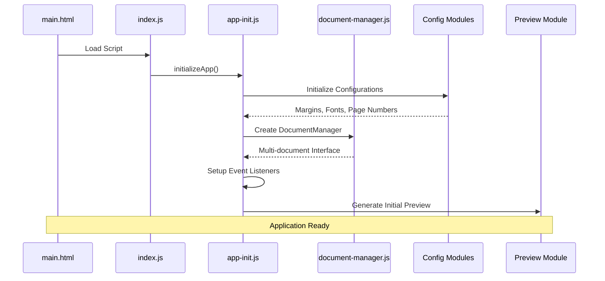
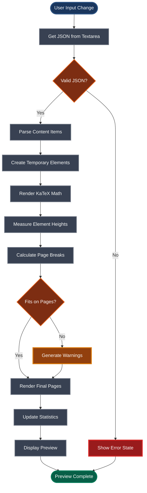
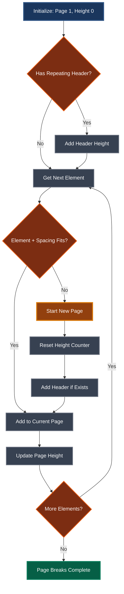
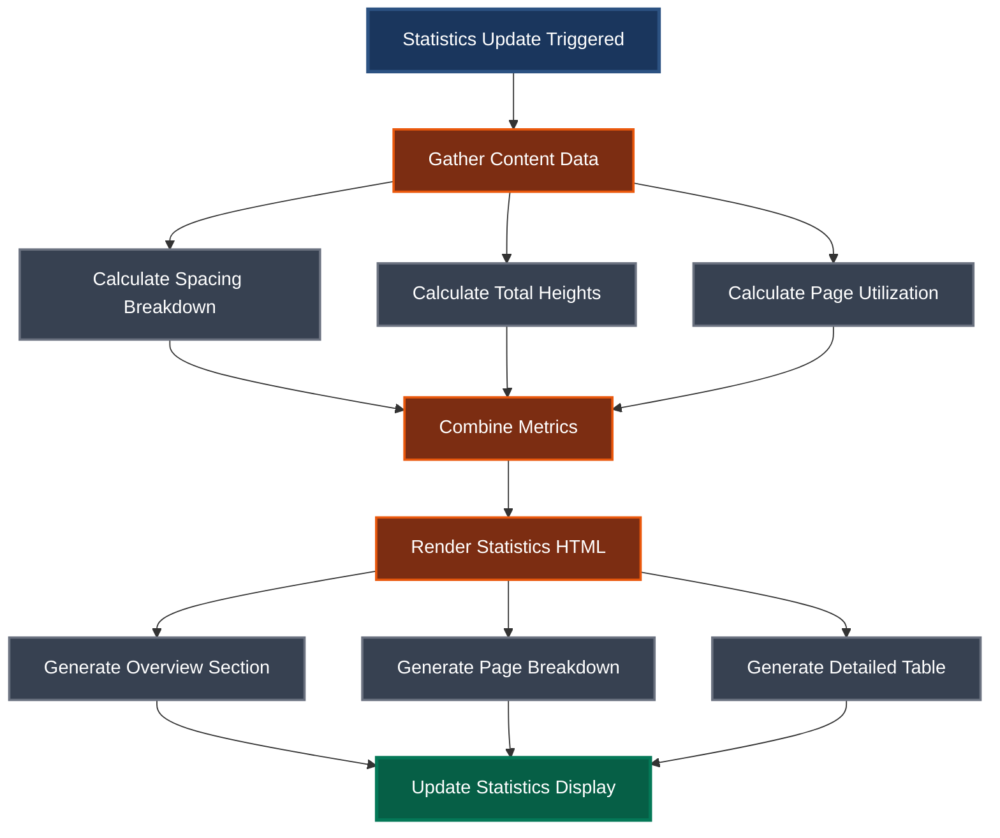
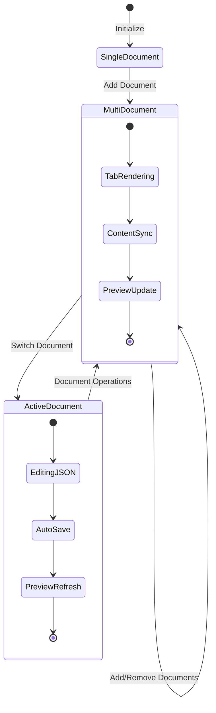
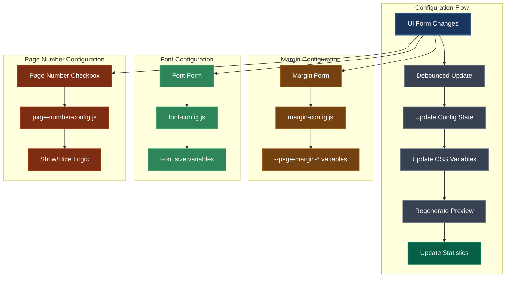
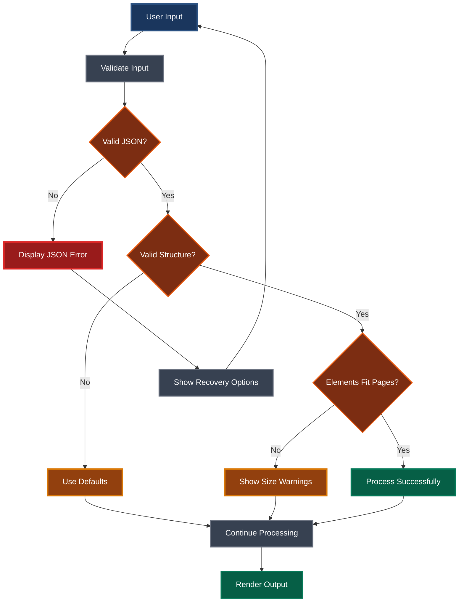
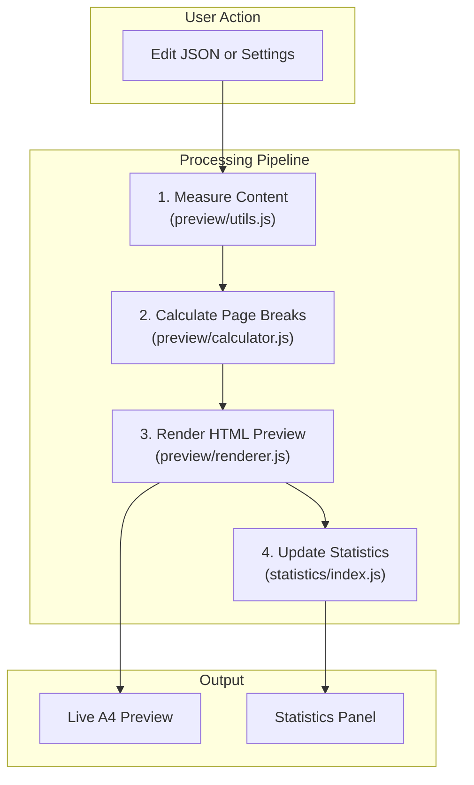

# Technical Summary

This document provides a technical overview of the PCA Papyrus application, a JavaScript-based tool for generating and previewing multi-page documents from structured JSON data.

## `/src` Directory Architecture

The `/src` directory contains all the application logic, organized into a modular architecture with clear separation of concerns.

### Overall Module Structure

```mermaid
graph TB
    subgraph "Entry Point"
        INDEX["`**index.js**
        Application Bootstrap`"]
    end
    
    subgraph "Core Modules"
        APPINIT["`**app-init.js**
        Application Initialization
        Event Handling`"]
        
        CONTENTMODEL["`**content-model.js**
        Data Model
        Page Calculations`"]
        
        PRINTMGR["`**print-manager.js**
        Print Functionality
        PDF Generation`"]
        
        DOCMGR["`**document-manager.js**
        Multi-Document Management`"]
    end
    
    subgraph "Configuration Modules"
        MARGINCONF["`**margin-config.js**
        Page Layout Settings`"]
        
        FONTCONF["`**font-config.js**
        Typography Settings`"]
        
        PAGENUMCONF["`**page-number-config.js**
        Page Numbering Settings`"]
    end
    
    subgraph "Preview Module"
        PREVINDEX["`**preview/index.js**
        Preview Orchestration`"]
        
        PREVCALC["`**preview/calculator.js**
        Page Break Logic`"]
        
        PREVRENDER["`**preview/renderer.js**
        HTML Generation`"]
        
        PREVUTILS["`**preview/utils.js**
        Helper Functions`"]
        
        PREVTYPES["`**preview/types.js**
        Type Definitions`"]
    end
    
    subgraph "Statistics Module"
        STATINDEX["`**statistics/index.js**
        Statistics Interface`"]
        
        STATCALC["`**statistics/calculator.js**
        Metrics Calculation`"]
        
        STATRENDER["`**statistics/renderer.js**
        Statistics Display`"]
        
        STATUTILS["`**statistics/utils.js**
        Data Utilities`"]
        
        STATTYPES["`**statistics/types.js**
        Type Definitions`"]
    end
    
    subgraph "Utilities"
        JSONHANDLER["`**utils/json-handler.js**
        JSON Processing
        Element Creation`"]
    end
    
    subgraph "Styles"
        STYLEDIR["`**styles/**
        CSS Modules
        Theming`"]
    end
    
    INDEX --> APPINIT
    APPINIT --> CONTENTMODEL
    APPINIT --> DOCMGR
    APPINIT --> MARGINCONF
    APPINIT --> FONTCONF
    APPINIT --> PAGENUMCONF
    APPINIT --> PREVINDEX
    
    PREVINDEX --> PREVCALC
    PREVINDEX --> PREVRENDER
    PREVINDEX --> PREVUTILS
    PREVINDEX --> JSONHANDLER
    PREVINDEX --> CONTENTMODEL
    
    CONTENTMODEL --> STATINDEX
    STATINDEX --> STATCALC
    STATINDEX --> STATRENDER
    STATINDEX --> STATUTILS
    
    PRINTMGR --> STYLEDIR
    
    %% Strong, high-contrast colors
    style INDEX fill:#1a365d,stroke:#2c5282,stroke-width:2px,color:#ffffff
    style APPINIT fill:#2d3748,stroke:#4a5568,stroke-width:2px,color:#ffffff
    style CONTENTMODEL fill:#2d3748,stroke:#4a5568,stroke-width:2px,color:#ffffff
    style PRINTMGR fill:#2d3748,stroke:#4a5568,stroke-width:2px,color:#ffffff
    style DOCMGR fill:#2d3748,stroke:#4a5568,stroke-width:2px,color:#ffffff
    style MARGINCONF fill:#744210,stroke:#975a16,stroke-width:2px,color:#ffffff
    style FONTCONF fill:#744210,stroke:#975a16,stroke-width:2px,color:#ffffff
    style PAGENUMCONF fill:#744210,stroke:#975a16,stroke-width:2px,color:#ffffff
    style PREVINDEX fill:#2f855a,stroke:#38a169,stroke-width:2px,color:#ffffff
    style PREVCALC fill:#2f855a,stroke:#38a169,stroke-width:2px,color:#ffffff
    style PREVRENDER fill:#2f855a,stroke:#38a169,stroke-width:2px,color:#ffffff
    style PREVUTILS fill:#2f855a,stroke:#38a169,stroke-width:2px,color:#ffffff
    style PREVTYPES fill:#2f855a,stroke:#38a169,stroke-width:2px,color:#ffffff
    style STATINDEX fill:#7c2d12,stroke:#9a3412,stroke-width:2px,color:#ffffff
    style STATCALC fill:#7c2d12,stroke:#9a3412,stroke-width:2px,color:#ffffff
    style STATRENDER fill:#7c2d12,stroke:#9a3412,stroke-width:2px,color:#ffffff
    style STATUTILS fill:#7c2d12,stroke:#9a3412,stroke-width:2px,color:#ffffff
    style STATTYPES fill:#7c2d12,stroke:#9a3412,stroke-width:2px,color:#ffffff
    style JSONHANDLER fill:#581c87,stroke:#6b21a8,stroke-width:2px,color:#ffffff
    style STYLEDIR fill:#1e3a8a,stroke:#2563eb,stroke-width:2px,color:#ffffff
```

### Application Initialization Flow

### Preview Generation Pipeline

### Page Break Calculation Algorithm

### Statistics Calculation Flow

### Document Management System

### Print System Architecture

```mermaid
flowchart LR
    USER[User Clicks Print] --> CHOICE{Print All or Active?}
    
    CHOICE -->|Active| ACTIVE[Get Active Document HTML]
    CHOICE -->|All| ALL[Combine All Documents HTML]
    
    ACTIVE --> IFRAME[Create Hidden Iframe]
    ALL --> IFRAME
    
    IFRAME --> STYLES[Inject Print Styles]
    STYLES --> FONTS[Apply Dynamic Fonts]
    FONTS --> KATEX[Render KaTeX Math]
    
    KATEX --> DIALOG[Open Print Dialog]
    DIALOG --> CLEANUP[Clean Up Iframe]
    
    %% High contrast colors
    style USER fill:#1a365d,stroke:#2c5282,stroke-width:3px,color:#ffffff
    style CLEANUP fill:#065f46,stroke:#047857,stroke-width:3px,color:#ffffff
    style CHOICE fill:#7c2d12,stroke:#ea580c,stroke-width:2px,color:#ffffff
    style ACTIVE fill:#374151,stroke:#6b7280,stroke-width:2px,color:#ffffff
    style ALL fill:#374151,stroke:#6b7280,stroke-width:2px,color:#ffffff
    style IFRAME fill:#374151,stroke:#6b7280,stroke-width:2px,color:#ffffff
    style STYLES fill:#374151,stroke:#6b7280,stroke-width:2px,color:#ffffff
    style FONTS fill:#374151,stroke:#6b7280,stroke-width:2px,color:#ffffff
    style KATEX fill:#374151,stroke:#6b7280,stroke-width:2px,color:#ffffff
    style DIALOG fill:#374151,stroke:#6b7280,stroke-width:2px,color:#ffffff
```

### Configuration System

### Error Handling and Validation

## Core Architecture

The application follows a modular, single-page application (SPA) architecture. The core logic is organized into focused modules responsible for distinct parts of the workflow, from data handling to rendering.

-   **`app-init.js`**: The main entry point. It initializes all other modules, sets up global event listeners for UI controls (forms, buttons), and orchestrates the overall application flow.
-   **`content-model.js`**: Defines the central data model for a document's content, managing the array of content items, their properties (like height), and page assignments.
-   **`/preview`**: A dedicated module for generating the live A4 preview.
    -   `index.js`: Orchestrates the preview generation process.
    -   `calculator.js`: Handles the core pagination logic, calculating where page breaks should occur based on element heights.
    -   `renderer.js`: Responsible for rendering the final HTML pages based on the calculated breaks.
    -   `utils.js`: Provides helper functions and constants for the preview module.
-   **`/statistics`**: A module for calculating and displaying content analytics.
    -   `index.js`: The public interface for updating the statistics display.
    -   `calculator.js`: Contains pure functions for calculating metrics like spacing and total height.
    -   `renderer.js`: Generates the HTML for the statistics panel.
-   **`print-manager.js`**: Manages the final print output, creating a print-friendly `<iframe>` with the necessary styles.
-   **Configuration Modules (`margin-config.js`, `font-config.js`, `page-number-config.js`)**: Each module manages a specific aspect of the document's appearance, updating CSS variables and triggering regeneration when changed.
-   **`json-handler.js`**: A utility module for parsing JSON from the UI and creating HTML elements from it.

## Process Flow

1.  **Initialization**:
    -   `app-init.js` runs on page load, setting up all configurations and event listeners.
    -   It prepares the application to respond to user input.

2.  **Live Preview Generation**:
    -   When the user modifies the JSON input or changes a setting, a debounced event triggers the `generatePages` function in the `/preview` module.
    -   **Measurement**: The preview module first creates temporary, off-screen elements to accurately measure their height, including any content rendered by KaTeX.
    -   **Pagination**: The `calculator.js` submodule takes these measurements and calculates where each page break should occur to fit the content within the defined A4 page dimensions and margins.
    -   **Rendering**: The `renderer.js` submodule then generates the final, paginated HTML and displays it in the preview panel.

3.  **Statistics Update**:
    -   After the preview is generated, the system updates the `contentModel` with the new element heights and page assignments.
    -   This data is then passed to the `/statistics` module, which calculates and renders the detailed breakdown of content, spacing, and page utilization.

4.  **Printing**:
    -   When the user clicks a print button, the `print-manager.js` module is invoked.
    -   It takes the HTML content from the current preview, wraps it in print-specific styles, injects it into a hidden `<iframe>`, and triggers the browser's print dialog.

## Visual Workflow

