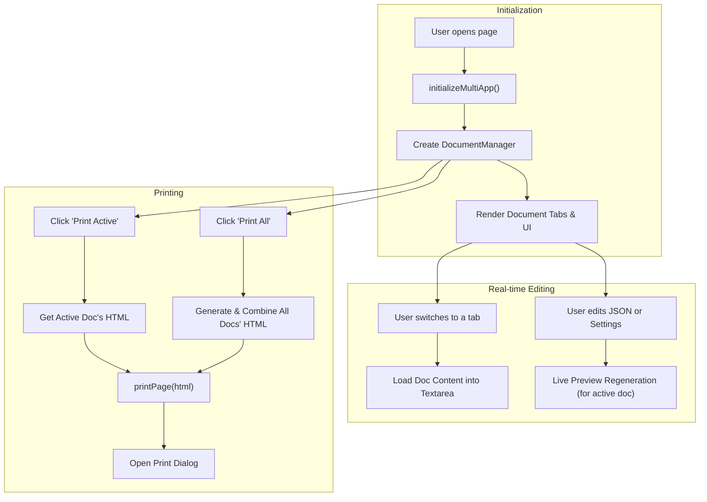

# Technical Summary of PDF Generation

This document provides a technical overview of the JavaScript-based PDF generation process used in PCA Papyrus, focusing on the features demonstrated in `scenery/main.html`.

## Core Modules

The PDF generation is handled by a set of interconnected JavaScript modules:

-   **`multi-app-init.js`**: The main entry point that initializes the application. It contains the `DocumentManager` class responsible for handling multiple JSON inputs and orchestrates the overall workflow.
-   **`preview-generator.js`**: Responsible for generating the multi-page preview from a given JSON data source.
-   **`print-manager.js`**: Handles the final print output by creating a new window with print-specific styling for the provided HTML content.
-   **`json-handler.js`**: Provides utility functions for parsing JSON and creating HTML elements from the JSON structure.
-   **`margin-config.js`**, **`font-config.js`**, **`page-number-config.js`**: These modules manage the configuration settings for margins, fonts, and page numbers.

## Process Flow

The process can be broken down into the following steps:

### 1. Initialization
-   The `initializeMultiApp` function in `multi-app-init.js` is called when the page loads.
-   It creates a `DocumentManager` instance, which is the central controller for the application.
-   It sets up event listeners for UI controls (settings forms, print buttons) and the main JSON textarea for live updates.
-   It dynamically renders the document tabs and adds buttons for creating and removing documents.

### 2. Document Management & Live Preview
-   The user can add, remove, or switch between documents using the tab interface.
-   When a user types in the JSON textarea for the active document, a debounced event triggers the `generateActivePreview` function.
-   This function uses `preview-generator.js` to create the multi-page preview for the active document's content. The preview on the right is updated in real-time.

### 3. Printing
-   **Print Active**: This button calls `printActiveDocument()`, which takes the pre-generated HTML from the active preview and sends it to the `printPage` function.
-   **Print All**: This button calls `printAllDocuments()`. This function iterates through all documents, generates their previews if needed, and then combines the HTML from all of them. It adds page breaks between documents and sends the final combined HTML to the `printPage` function.
-   The `printPage` function in `print-manager.js` opens a new browser window, writes the received HTML content and print-specific CSS into it, and opens the browser's print dialog.

## Key Concepts

### Dynamic Height Calculation
The application uses a multi-step process to handle the dynamic height of elements, especially those containing math formulas rendered with KaTeX:
1.  **Create a temporary off-screen page** to prevent flicker during measurement.
2.  **Render elements and KaTeX** onto this temporary page.
3.  **Measure heights** of each element after a short delay to allow for rendering.
4.  **Calculate page breaks** based on the measured heights and available page space.

### Multi-Document Architecture
The `DocumentManager` class is the core of the multi-document system. It maintains an array of document objects, each containing its own ID, name, JSON content, and generated HTML preview. This architecture allows for a flexible number of documents to be managed simultaneously, moving beyond the original two-document limit.

## Visual Workflow

